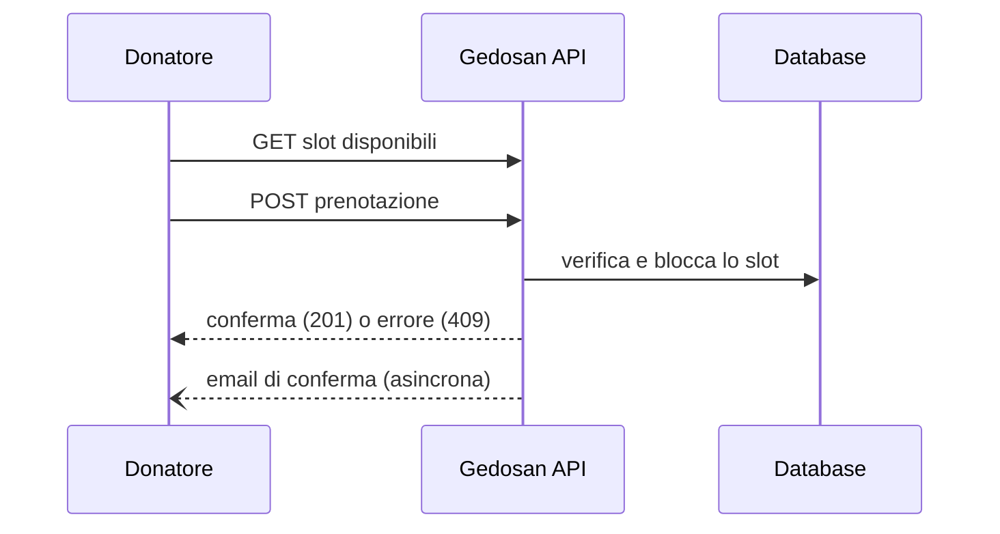
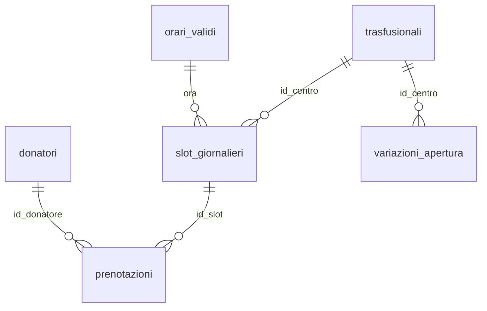

# Gedosan API

Backend REST per la gestione delle prenotazioni di donazione sangue presso i centri trasfusionali. Espone un flusso pubblico per i donatori (consultazione disponibilità e prenotazione, senza login) e un flusso amministrativo autenticato via JWT per la gestione di prenotazioni e orari di apertura.

## Indice

- [Stack tecnologico](#stack-tecnologico)
- [Architettura](#architettura)
- [Modello dati](#modello-dati)
- [Regole di business](#regole-di-business)
- [Avvio in locale](#avvio-in-locale)
- [Endpoint API](#endpoint-api)
- [Esempi d'uso](#esempi-duso)
- [Sicurezza](#sicurezza)
- [Gestione degli errori](#gestione-degli-errori)

## Stack tecnologico

| Componente | Tecnologia |
|---|---|
| Linguaggio | Java 21 |
| Framework | Spring Boot |
| Persistenza | Spring Data JPA / Hibernate |
| Database | MySQL 8 |
| Migrazioni schema | Flyway |
| Sicurezza | Spring Security, JWT |
| Rate limiting | Bucket4j |
| Generazione PDF | OpenPDF |
| Invio email | Spring Mail (SMTP) |

## Architettura

Struttura a livelli standard, package base `it.vszdev.gedosanapi`:

```
controller/   endpoint REST (pub/ per il donatore, admin/ protetti da JWT)
service/      logica di business e regole di dominio
repositories/ accesso ai dati (Spring Data JPA)
models/       entità JPA
dto/          oggetti di richiesta/risposta
security/     autenticazione JWT e rate limiting
validation/   validatori custom (codice fiscale e coerenza anagrafica)
exception/    eccezioni di dominio e gestione centralizzata degli errori
events/       invio email asincrono dopo una prenotazione
config/       configurazione applicativa
```

Le regole di validazione delle prenotazioni (età, intervallo tra donazioni, apertura del centro, disponibilità dello slot) sono centralizzate in `PrenotazioneService` e valgono identicamente sia per il donatore che per l'admin.

### Flusso di prenotazione



## Modello dati



| Tabella | Ruolo |
|---|---|
| `trasfusionali` | Centri di raccolta |
| `orari_validi` | Fasce orarie ammesse, comuni a tutti i centri |
| `slot_giornalieri` | Centro + orario + data, con `posti_occupati` (max 2), creato on-demand |
| `donatori` | Anagrafica, con `codice_fiscale` ed `email` univoci |
| `prenotazioni` | Associazione donatore ↔ slot |
| `festivi_ricorrenti` | Festivi a data fissa, comuni a tutti i centri |
| `variazioni_apertura` | Chiusure o aperture straordinarie per centro e data |

## Regole di business

Parametrizzabili tramite `application.properties` (prefisso `prenotazioni.*`):

| Proprietà | Descrizione | Default |
|---|---|---|
| `orizzonte-giorni` | Giorni futuri massimi prenotabili | 60 |
| `eta-minima` | Età minima per donare | 18 |
| `intervallo-uomini-giorni` | Intervallo minimo tra donazioni (uomini) | 90 |
| `intervallo-donne-giorni` | Intervallo minimo tra donazioni (donne) | 365 |
| `posti-per-slot` | Prenotazioni massime per slot orario | 2 |

Il codice fiscale non è validato solo nella forma: viene decodificato (gestendo anche l'omocodia) e confrontato con data di nascita e sesso dichiarati, rifiutando la prenotazione se non combaciano.

## Avvio in locale

Richiede Java 21+ e Docker.

```bash
docker compose up -d          # avvia un MySQL vuoto
./mvnw spring-boot:run        # Flyway applica schema e dati demo
```

L'API risponde su `http://localhost:8080`. Nessuna configurazione richiesta: i default in `application.properties` combaciano già con `docker-compose.yml`.

Per un'istanza MySQL diversa, basta impostare le variabili `DB_HOST`, `DB_USERNAME`, `DB_PASSWORD` nell'ambiente prima dell'avvio.

### Credenziali demo

| Username | Password |
|---|---|
| `demo` | `demo1234` |

## Endpoint API

### Pubblico (nessuna autenticazione)

| Metodo | Endpoint | Descrizione |
|---|---|---|
| `GET` | `/api/trasfusionali` | Elenco centri |
| `GET` | `/api/trasfusionali/{id}/giorni-non-disponibili?mese=YYYY-MM` | Giorni non prenotabili del mese |
| `GET` | `/api/trasfusionali/{id}/slot?data=YYYY-MM-DD` | Slot disponibili in una data |
| `POST` | `/api/prenotazioni` | Crea una prenotazione |

### Amministrativo (richiede `Authorization: Bearer <token>`)

| Metodo | Endpoint | Descrizione |
|---|---|---|
| `POST` | `/api/auth/login` | Login, restituisce un token JWT |
| `GET` | `/api/admin/prenotazioni?idTrasfusionale=&data=` | Elenco prenotazioni |
| `PATCH` | `/api/admin/prenotazioni/{id}` | Riprogrammazione su un nuovo slot |
| `DELETE` | `/api/admin/prenotazioni/{id}` | Cancellazione |
| `GET`/`POST`/`DELETE` | `/api/admin/variazioni-apertura` | Gestione aperture/chiusure straordinarie |
| `GET` | `/api/admin/log-modifiche` | Storico modifiche effettuate dagli admin |
| `GET` | `/api/admin/prenotazioni/esportazione?...` | Esportazione PDF delle prenotazioni del giorno |

## Esempi d'uso

```bash
# Slot disponibili
curl "http://localhost:8080/api/trasfusionali/1/slot?data=2026-09-15"

# Creazione prenotazione
curl -X POST http://localhost:8080/api/prenotazioni \
  -H "Content-Type: application/json" \
  -d '{
    "nome": "Mario", "cognome": "Rossi",
    "dataNascita": "1985-04-12", "sesso": "M",
    "codiceFiscale": "RSSMRA85D12H501Z",
    "email": "mario.rossi@example.com",
    "cellulare": "+393401234567",
    "idSlot": 12, "tipoDonazione": "SI"
  }'
```

```bash
# Login admin (utente demo)
TOKEN=$(curl -s -X POST http://localhost:8080/api/auth/login \
  -H "Content-Type: application/json" \
  -d '{ "username": "demo", "password": "demo1234" }' | jq -r .token)

# Elenco prenotazioni di un centro
curl "http://localhost:8080/api/admin/prenotazioni?idTrasfusionale=1&data=2026-09-15" \
  -H "Authorization: Bearer $TOKEN"
```

## Sicurezza

- Autenticazione JWT (HMAC) per gli endpoint amministrativi, applicazione stateless (nessuna sessione HTTP).
- Password admin hashate con BCrypt.
- CORS configurabile tramite `cors.allowed-origins`.
- Rate limiting (Bucket4j) sugli endpoint sensibili (login, creazione prenotazione), con supporto all'header `CF-Connecting-IP` dietro proxy/CDN.

## Gestione degli errori

Formato JSON uniforme per ogni errore:

```json
{
  "status": 409,
  "errore": "Slot esaurito",
  "messaggio": "Lo slot selezionato non è più disponibile.",
  "path": "/api/prenotazioni"
}
```

| Stato | Caso |
|---|---|
| `400` | Validazione fallita (campo per campo) |
| `401` | Login fallito |
| `404` | Risorsa non trovata |
| `409` | Slot esaurito, centro chiuso, età/intervallo non rispettati, email già associata |
| `429` | Rate limit superato |
| `500` | Errore interno |


## Licenza

© 2026 vszdev. Codice sorgente reso pubblico a scopo dimostrativo e di consultazione.
