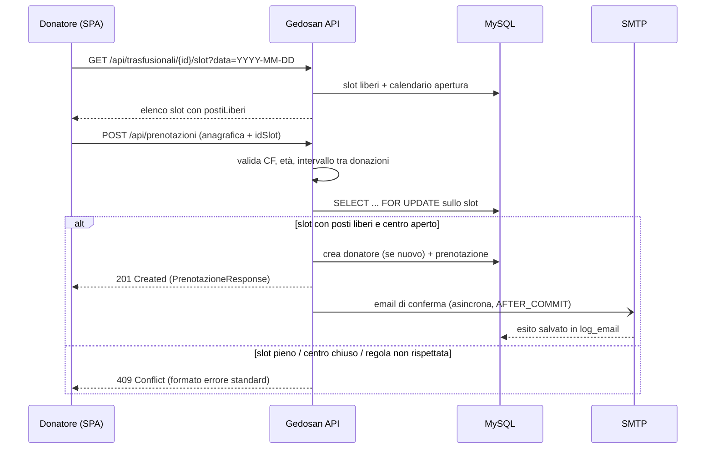
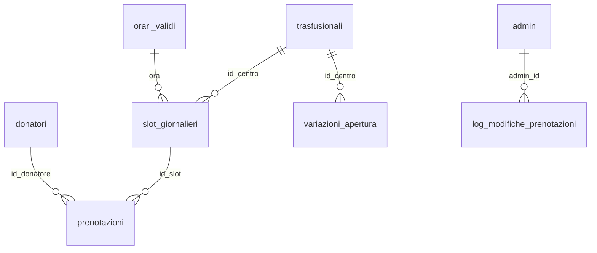

# Gedosan API

Backend REST per la gestione delle prenotazioni di donazione sangue presso i centri trasfusionali. Espone un flusso pubblico per i donatori (consultazione disponibilità e prenotazione, senza login) e un flusso amministrativo autenticato via JWT per la gestione di prenotazioni, orari di apertura e storico modifiche.

## Indice

- [Panoramica](#panoramica)
- [Stack tecnologico](#stack-tecnologico)
- [Architettura](#architettura)
- [Modello dati](#modello-dati)
- [Regole di business](#regole-di-business)
- [Requisiti](#requisiti)
- [Configurazione](#configurazione)
- [Gestione dello schema del database](#gestione-dello-schema-del-database)
- [Avvio](#avvio)
- [Endpoint API](#endpoint-api)
- [Esempi d'uso](#esempi-duso)
- [Sicurezza](#sicurezza)
- [Gestione degli errori](#gestione-degli-errori)
- [Email e PDF](#email-e-pdf)
- [Logging](#logging)
- [Test](#test)
- [Deployment](#deployment)
- [Licenza](#licenza)

## Panoramica

Gedosan API gestisce il ciclo di vita delle prenotazioni per la donazione di sangue presso una rete di centri trasfusionali. Il sistema è pensato per due tipi di utenti:

- **Donatore**: consulta le disponibilità di un centro trasfusionale e prenota una donazione, senza necessità di registrazione o autenticazione.
- **Amministratore**: si autentica con credenziali JWT e gestisce le prenotazioni (creazione, riprogrammazione, cancellazione, esportazione PDF), le variazioni di apertura dei centri e consulta lo storico delle modifiche.

Ogni prenotazione confermata genera automaticamente un'email di conferma al donatore, inviata in modo asincrono e tracciata in un log dedicato.

## Stack tecnologico

| Componente | Tecnologia |
|---|---|
| Linguaggio | Java 21 |
| Framework | Spring Boot 4.1.1 |
| Persistenza | Spring Data JPA / Hibernate |
| Database | MySQL 8 |
| Migrazioni schema | Flyway |
| Sicurezza | Spring Security, JWT (jjwt 0.12.6) |
| Rate limiting | Bucket4j + Caffeine |
| Generazione PDF | OpenPDF |
| Invio email | Spring Mail (SMTP, Brevo) |
| Build | Maven (wrapper incluso) |
| Monitoraggio | Spring Boot Actuator |

## Architettura

Il progetto segue una struttura a livelli tipica di un'applicazione Spring Boot. Package base: `it.vszdev.gedosanapi`.

```
controller/   endpoint REST, separati in pub/ (donatore) e admin/ (JWT)
service/      logica di business e regole di dominio
repositories/ accesso ai dati tramite Spring Data JPA
models/       entità JPA che mappano lo schema del database
dto/          oggetti di richiesta/risposta esposti dalle API
security/     JwtAuthFilter, JwtService, rate limiting, AdminPrincipal
validation/   validatori custom (Codice Fiscale e sua coerenza con l'anagrafica)
exception/    eccezioni di dominio e GlobalExceptionHandler
events/       evento + listener per l'invio email asincrono dopo una prenotazione
config/       SecurityConfig, CorsConfig, proprietà applicative, AsyncConfig
```

Le regole di validazione delle prenotazioni (età minima, intervallo tra donazioni, apertura del centro, disponibilità dello slot) sono centralizzate in `PrenotazioneService` e applicate identicamente sia al flusso pubblico che a quello amministrativo, senza eccezioni per gli operatori.

### Flusso di prenotazione (donatore)



## Modello dati



| Tabella | Ruolo |
|---|---|
| `trasfusionali` | Centri di raccolta. |
| `orari_validi` | Fasce orarie ammesse (PK sull'orario), condivise da tutti i centri. |
| `slot_giornalieri` | Slot concreto = centro + orario + data, con `posti_occupati` (0–2). Creato on-demand alla prima prenotazione utile e ripulito da un job schedulato quando obsoleto. Unico per `(id_centro, ora, data)`. |
| `donatori` | Anagrafica donatore, con `codice_fiscale` ed `email` univoci. Creata al volo alla prima prenotazione. |
| `prenotazioni` | Associazione donatore ↔ slot. |
| `festivi_ricorrenti` | Festivi a data fissa (mese/giorno), centro-indipendenti. |
| `variazioni_apertura` | Override straordinari di apertura/chiusura per centro e data. |
| `log_email` | Esito (`OK`/`KO`) di ogni tentativo di invio email, con eventuale errore. |
| `log_modifiche_prenotazioni` | Storico di riprogrammazioni e cancellazioni fatte dagli admin, con snapshot del nome donatore. |

L'apertura di un centro in una certa data è la combinazione di: calendario ordinario degli `orari_validi`, esclusione dei `festivi_ricorrenti`, e infine le `variazioni_apertura` che hanno la precedenza su entrambi.

## Regole di business

Le regole principali sono parametrizzabili tramite `application.properties` (prefisso `prenotazioni.*`):

| Proprietà | Descrizione | Default |
|---|---|---|
| `prenotazioni.orizzonte-giorni` | Numero massimo di giorni futuri prenotabili | 60 |
| `prenotazioni.eta-minima` | Età minima richiesta per donare | 18 |
| `prenotazioni.intervallo-uomini-giorni` | Intervallo minimo tra due donazioni per donatori uomini | 90 |
| `prenotazioni.intervallo-donne-giorni` | Intervallo minimo tra due donazioni per donatrici donne | 365 |
| `prenotazioni.distanza-minima-donne-giorni` | Distanza minima aggiuntiva per le donne | 90 |
| `prenotazioni.posti-per-slot` | Numero massimo di prenotazioni per ogni slot orario | 2 |

Ulteriori vincoli applicati automaticamente:

- Il centro trasfusionale deve risultare aperto nella data richiesta (calendario ordinario + festivi ricorrenti + variazioni di apertura straordinarie).
- Lo slot selezionato viene bloccato a livello di riga (`SELECT ... FOR UPDATE`) al momento della prenotazione, per prevenire race condition su richieste concorrenti.
- L'email del donatore è normalizzata (trim + lowercase) e il codice fiscale viene validato e normalizzato prima del salvataggio.

### Validazione del codice fiscale

Il codice fiscale non è solo controllato nella forma (lunghezza, carattere di controllo): viene **decodificato e messo a confronto con l'anagrafica dichiarata**. `@CodiceFiscale` verifica la struttura e il carattere di controllo; `@CoerenzaCodiceFiscale` (validatore a livello di record) estrae data di nascita e sesso codificati nel CF e li confronta con i campi `dataNascita` e `sesso` della richiesta, rifiutando la prenotazione se non combaciano. La decodifica gestisce l'**omocodia** (sostituzione di cifre con lettere nei CF duplicati).

## Requisiti

- Java 21 o superiore
- Maven 3.9+ (oppure il wrapper `mvnw` incluso nel repository)
- Un database MySQL 8: via **Docker Compose** (incluso, consigliato per provare il progetto) oppure un'istanza MySQL già disponibile
- Docker + Docker Compose, solo se si usa il database containerizzato
- Account SMTP per l'invio delle email (es. Brevo) — opzionale in locale, l'invio fallisce senza bloccare il resto

Per il solo avvio locale con Docker Compose non serve configurare nulla: vedi [Avvio](#avvio).

## Configurazione

L'applicazione utilizza due profili di configurazione:

- `application.properties` — profilo di sviluppo locale
- `application-prod.properties` — profilo di produzione, attivato con `SPRING_PROFILES_ACTIVE=prod`

### Variabili d'ambiente

Nel profilo **dev** ogni variabile ha un valore di default (in `application.properties`) che combacia con il database di `docker-compose.yml`, quindi l'avvio in locale funziona senza impostare nulla. Le variabili servono solo per puntare a un database/SMTP diverso, o in **produzione**, dove non esiste alcun default e una variabile mancante blocca l'avvio.

| Variabile | Utilizzo | Default (dev) | Prod |
|---|---|---|---|
| `DB_USERNAME` | Utente del database MySQL | `gedosan` | obbligatoria |
| `DB_PASSWORD` | Password del database MySQL | `gedosan_dev` | obbligatoria |
| `DB_HOST`, `DB_PORT`, `DB_NAME` | Host/porta/nome del database | *(URL fisso `localhost:3306/donazioni_db`)* | obbligatorie |
| `MAIL_USERNAME`, `MAIL_PASSWORD` | Credenziali SMTP | *(vuote)* | obbligatorie |
| `MAIL_HOST`, `MAIL_PORT` | Server SMTP | `smtp-relay.brevo.com:587` | obbligatorie |
| `JWT_SECRET` | Chiave HMAC per la firma dei token JWT (Base64, ≥ 32 byte) | *(vuota)* | obbligatoria |
| `CORS_ALLOWED_ORIGINS` | Origini consentite per le richieste cross-origin, separate da virgola senza spazi | `http://localhost:4200,http://localhost:4300` | obbligatoria |
| `SERVER_PORT` | Porta di ascolto dell'applicazione | `8080` | obbligatoria |

Il file [`.env.example`](.env.example) elenca le variabili del profilo di produzione: copiarlo in un `.env` non versionato sul server e valorizzarlo.

> Per usare il flusso admin in locale serve un `JWT_SECRET` valido, ad esempio `export JWT_SECRET=$(openssl rand -base64 32)`.

## Gestione dello schema del database

Lo schema è versionato con **Flyway** (*database as code*) e applicato automaticamente all'avvio dell'applicazione. Non serve importare dump o creare tabelle a mano.

```
src/main/resources/db/
├── migration/   → V1__init_schema.sql, ...   schema (tutti i profili)
└── demo/        → R__seed_demo.sql             dati demo (solo profili non-prod)
```

- **`db/migration`** — migrazioni versionate dello schema. Eseguite in ogni ambiente. `spring.jpa.hibernate.ddl-auto=validate`: Flyway costruisce lo schema, Hibernate verifica solo che corrisponda alle entità.
- **`db/demo`** — migrazione *repeatable* con dati di esempio (un admin, orari, centri, festivi nazionali). Caricata solo in locale grazie a `spring.flyway.locations`; in produzione questa cartella non viene mai letta.
- Su un database **già esistente** (creato prima di Flyway) è attivo `spring.flyway.baseline-on-migrate=true`: al primo avvio Flyway registra lo stato come baseline invece di rieseguire `V1`.
- In produzione `flyway:clean` è disabilitato (`spring.flyway.clean-disabled=true`).

Per aggiungere una modifica allo schema: creare un nuovo file `V2__descrizione.sql` (poi `V3__...`) in `db/migration`.

### Credenziali admin demo

La migrazione `db/demo` crea un amministratore di prova:

| Username | Password |
|---|---|
| `demo` | `demo1234` |

## Avvio

### In locale con Docker Compose (consigliato)

Non richiede alcuna configurazione: `docker-compose.yml` avvia un MySQL con credenziali fittizie che combaciano con i default del profilo dev.

```bash
docker compose up -d          # avvia MySQL (vuoto)
./mvnw spring-boot:run        # avvia l'API: Flyway applica schema + dati demo
```

L'API risponde su `http://localhost:8080`. Per fermare e ripulire tutto:

```bash
docker compose down -v
```

### In locale con un'istanza MySQL propria

1. Creare il database `donazioni_db` e un utente dedicato con privilegi sullo schema:

   ```sql
   CREATE DATABASE donazioni_db CHARACTER SET utf8mb4 COLLATE utf8mb4_0900_ai_ci;
   CREATE USER 'gedosan'@'localhost' IDENTIFIED BY 'una_password';
   GRANT SELECT, INSERT, UPDATE, DELETE, CREATE, ALTER, DROP, INDEX, REFERENCES
     ON donazioni_db.* TO 'gedosan'@'localhost';
   FLUSH PRIVILEGES;
   ```

2. Passare le credenziali via variabili d'ambiente (o nella run configuration dell'IDE):

   ```bash
   export DB_USERNAME=gedosan
   export DB_PASSWORD=una_password
   ./mvnw spring-boot:run
   ```

Flyway crea lo schema e i dati demo al primo avvio.

> Nota MySQL 8: se l'utente usa il plugin `caching_sha2_password` (default), l'URL JDBC di sviluppo include già `allowPublicKeyRetrieval=true` per consentire la connessione non-SSL in locale.

### Build ed esecuzione del pacchetto

```bash
./mvnw clean package
java -jar target/Gedosan-API-0.0.1-SNAPSHOT.jar
```

### Produzione

```bash
SPRING_PROFILES_ACTIVE=prod java -jar target/Gedosan-API-0.0.1-SNAPSHOT.jar
```

L'applicazione espone le API sulla porta `8080`, configurabile con `SERVER_PORT`.

## Endpoint API

### Flusso pubblico (donatore)

Nessuna autenticazione richiesta.

| Metodo | Endpoint | Descrizione |
|---|---|---|
| `GET` | `/api/trasfusionali` | Elenco dei centri trasfusionali disponibili |
| `GET` | `/api/trasfusionali/{idTrasfusionale}/giorni-non-disponibili?mese=YYYY-MM` | Giorni non prenotabili del mese per un centro |
| `GET` | `/api/trasfusionali/{idTrasfusionale}/slot?data=YYYY-MM-DD` | Slot orari disponibili in una data |
| `POST` | `/api/prenotazioni` | Crea una nuova prenotazione (anagrafica donatore + slot + tipo donazione) |

### Flusso amministrativo

Richiede header `Authorization: Bearer <token>`, salvo `/api/auth/login`.

| Metodo | Endpoint | Descrizione |
|---|---|---|
| `POST` | `/api/auth/login` | Autenticazione amministratore, restituisce un token JWT |
| `GET` | `/api/admin/prenotazioni?idTrasfusionale=&data=` | Elenco prenotazioni di un centro in una data |
| `GET` | `/api/admin/prenotazioni/{id}` | Dettaglio di una prenotazione |
| `GET` | `/api/admin/prenotazioni/esportazione?idTrasfusionale=&data=` | Esportazione PDF delle prenotazioni del giorno |
| `POST` | `/api/admin/prenotazioni` | Creazione di una prenotazione da parte dell'amministratore |
| `PATCH` | `/api/admin/prenotazioni/{id}` | Riprogrammazione di una prenotazione su un nuovo slot |
| `DELETE` | `/api/admin/prenotazioni/{id}` | Cancellazione di una prenotazione |
| `GET` | `/api/admin/variazioni-apertura?idTrasfusionale=` | Elenco delle variazioni straordinarie di apertura/chiusura |
| `POST` | `/api/admin/variazioni-apertura` | Creazione di una o più variazioni di apertura |
| `DELETE` | `/api/admin/variazioni-apertura/{id}` | Rimozione di una variazione di apertura |
| `GET` | `/api/admin/log-modifiche` | Storico delle modifiche (riprogrammazioni e cancellazioni) effettuate dagli amministratori |

### Monitoraggio

| Metodo | Endpoint | Descrizione |
|---|---|---|
| `GET` | `/actuator/health` | Stato di salute dell'applicazione (pubblico) |

## Esempi d'uso

Esempi con l'ambiente locale (`http://localhost:8080`) e i dati demo caricati da Flyway. Il primo centro trasfusionale ha `id = 1`.

### Flusso pubblico — prenotazione

1. Slot disponibili per un centro in una data:

   ```bash
   curl "http://localhost:8080/api/trasfusionali/1/slot?data=2026-09-15"
   ```

   ```json
   [
     { "idSlot": 12, "orario": "08:00:00", "disponibile": true, "postiLiberi": 2 },
     { "idSlot": 13, "orario": "08:30:00", "disponibile": true, "postiLiberi": 1 }
   ]
   ```

2. Creazione della prenotazione (anagrafica donatore + `idSlot`). Data di nascita e sesso devono essere coerenti con il codice fiscale:

   ```bash
   curl -X POST http://localhost:8080/api/prenotazioni \
     -H "Content-Type: application/json" \
     -d '{
       "nome": "Mario",
       "cognome": "Rossi",
       "dataNascita": "1985-04-12",
       "sesso": "M",
       "codiceFiscale": "RSSMRA85D12H501Z",
       "email": "mario.rossi@example.com",
       "cellulare": "+393401234567",
       "idSlot": 12,
       "tipoDonazione": "SI"
     }'
   ```

   ```json
   {
     "id": 47,
     "nomeDonatore": "Mario",
     "cognomeDonatore": "Rossi",
     "nomeTrasfusionale": "Centro Trasfusionale Demo Nord",
     "dataPrenotazione": "2026-09-15",
     "orarioPrenotazione": "08:00:00",
     "tipoDonazione": "SI"
   }
   ```

   Se lo slot è pieno, il centro è chiuso o una regola non è rispettata, la risposta è `409` nel formato di errore standard (vedi [Gestione degli errori](#gestione-degli-errori)).

### Flusso amministrativo

1. Login (utente demo: `demo` / `demo1234`):

   ```bash
   curl -X POST http://localhost:8080/api/auth/login \
     -H "Content-Type: application/json" \
     -d '{ "username": "demo", "password": "demo1234" }'
   ```

   ```json
   { "token": "eyJhbGciOiJIUzI1NiJ9...", "scadenza": "2026-08-28T12:15:00Z" }
   ```

2. Uso del token sugli endpoint protetti:

   ```bash
   TOKEN="eyJhbGciOiJIUzI1NiJ9..."

   # Prenotazioni di un centro in una data
   curl "http://localhost:8080/api/admin/prenotazioni?idTrasfusionale=1&data=2026-09-15" \
     -H "Authorization: Bearer $TOKEN"

   # Riprogrammazione su un nuovo slot
   curl -X PATCH http://localhost:8080/api/admin/prenotazioni/47 \
     -H "Authorization: Bearer $TOKEN" \
     -H "Content-Type: application/json" \
     -d '{ "idSlotNuovo": 20 }'

   # Chiusura straordinaria di uno o più centri in una data
   curl -X POST http://localhost:8080/api/admin/variazioni-apertura \
     -H "Authorization: Bearer $TOKEN" \
     -H "Content-Type: application/json" \
     -d '{ "idTrasfusionali": [1], "dataVariazione": "2026-12-24", "apertura": false, "motivo": "Vigilia" }'

   # Esportazione PDF delle prenotazioni del giorno
   curl "http://localhost:8080/api/admin/prenotazioni/esportazione?idTrasfusionale=1&data=2026-09-15" \
     -H "Authorization: Bearer $TOKEN" -o prenotazioni.pdf
   ```

## Sicurezza

- **Autenticazione**: gli endpoint amministrativi sono protetti da JWT firmato con chiave HMAC (`jwt.secret`), con scadenza configurabile (`jwt.expiration-ms`, default 15 minuti). Il subject del token è l'ID numerico dell'amministratore.
- **Sessioni**: l'applicazione è completamente stateless (`SessionCreationPolicy.STATELESS`); non vengono usate sessioni HTTP né cookie di autenticazione.
- **Password**: le credenziali amministratore sono hashate con BCrypt.
- **CORS**: le origini consentite sono configurabili tramite `cors.allowed-origins`; sono ammessi i metodi `GET, POST, PATCH, DELETE, OPTIONS` e gli header `Authorization, Content-Type`.
- **Rate limiting**: implementato con Bucket4j, applicato per indirizzo IP (con supporto all'header `CF-Connecting-IP` dietro proxy/CDN):
  - `POST /api/auth/login`: massimo 5 richieste ogni 5 minuti
  - `POST /api/prenotazioni`: massimo 5 richieste al minuto
  - Il superamento del limite restituisce `429 Too Many Requests` con corpo JSON coerente con il formato di errore standard.
- **CSRF**: disabilitato, coerentemente con un'API stateless consumata da client separati (SPA/mobile).

## Gestione degli errori

Tutte le risposte di errore seguono un formato JSON uniforme, prodotto dal `GlobalExceptionHandler`:

```json
{
  "status": 409,
  "errore": "Slot esaurito",
  "messaggio": "Lo slot selezionato non è più disponibile. Scegli un altro orario.",
  "path": "/api/prenotazioni",
  "erroriValidazione": null
}
```

Principali mappature stato HTTP / eccezione di dominio:

| Stato | Eccezione | Descrizione |
|---|---|---|
| `401` | `CredenzialiNonValideException` | Login fallito |
| `404` | `RisorsaNonTrovataException` | Risorsa non trovata (es. slot inesistente) |
| `409` | `SlotEsauritoException` | Slot senza posti disponibili |
| `409` | `GiornoChiusoException` | Centro chiuso nella data richiesta |
| `409` | `EtaNonValidaException` | Età del donatore inferiore al minimo |
| `409` | `IntervalloNonRispettatoException` | Intervallo minimo tra donazioni non rispettato |
| `409` | `EmailAssociataAdAltroDonatoreException` | Email già associata a un altro donatore |
| `400` | Errori di validazione (`@Valid`, parametri) | Corpo o parametri della richiesta non validi, con dettaglio per campo |
| `429` | Rate limit superato | Troppe richieste dallo stesso client |
| `500` | Eccezione generica non gestita | Errore interno, loggato lato server |

## Email e PDF

- **Conferma prenotazione**: alla creazione di una prenotazione viene pubblicato un evento applicativo gestito da `PrenotazioneEmailListener`, che invia in modo asincrono (thread pool dedicato `emailExecutor`) un'email di conferma al donatore tramite SMTP.
- **Log invii**: ogni tentativo di invio email viene tracciato nella tabella `log_email` con relativo esito (`OK`/`KO`) ed eventuale messaggio di errore.
- **Esportazione PDF**: l'amministratore può esportare in PDF l'elenco delle prenotazioni di un centro per una data specifica, generato tramite OpenPDF.

## Logging

- I log applicativi vengono scritti su file (`logs/app.log`) con rotazione automatica (dimensione massima 20MB, retention 30 giorni, cap totale 1GB).
- Livello di log applicativo: `DEBUG` in sviluppo, `INFO` in produzione.
- I dettagli dello stato di salute (`/actuator/health`) sono visibili in dev (`show-details=always`) e nascosti in produzione (`show-details=never`).

## Test

```bash
./mvnw test
```

I test sono collocati in `src/test/java/it/vszdev/gedosanapi/` e utilizzano gli starter di test di Spring Boot (Data JPA, Security, Validation, Web MVC, Mail).

## Deployment

L'applicazione è pensata per il deployment containerizzato in produzione: il profilo `application-prod.properties` risolve l'host del database tramite un nome di servizio di rete Docker (`DB_HOST`) anziché un indirizzo locale, e i segreti sono attesi come variabili d'ambiente iniettate da una pipeline CI/CD (es. GitHub Actions) o da un file `.env` non versionato sul server (vedi [`.env.example`](.env.example)).

Il file `docker-compose.yml` presente nel repository è **solo** per lo sviluppo locale e non va usato in produzione.

Allo startup Flyway applica le migrazioni presenti in `db/migration` al database di produzione. Al primo deploy su un database preesistente, `spring.flyway.baseline-on-migrate=true` ne registra lo stato come baseline; la riga può essere rimossa dopo il primo avvio riuscito.

## Licenza

© 2026 vszdev. Codice sorgente reso pubblico a scopo dimostrativo e di consultazione.
Non è concesso alcun permesso di uso, copia, modifica o ridistribuzione.

Contatto: _(inserire email o profilo di riferimento)_
